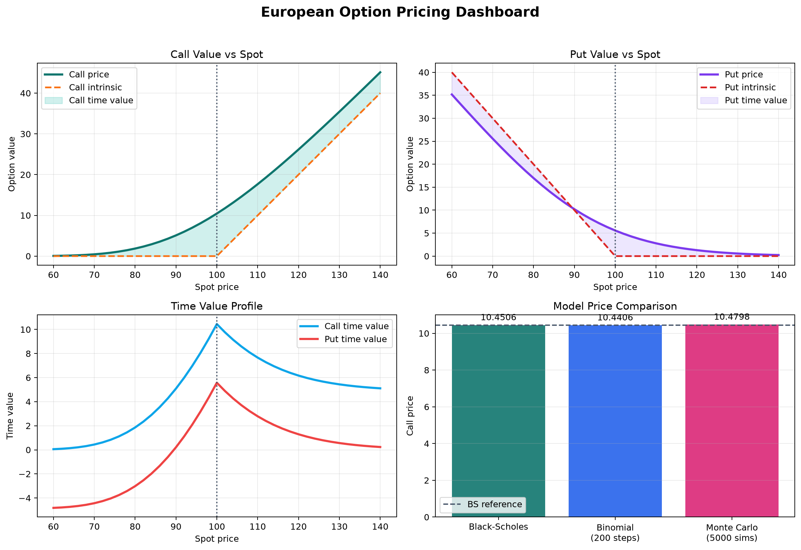
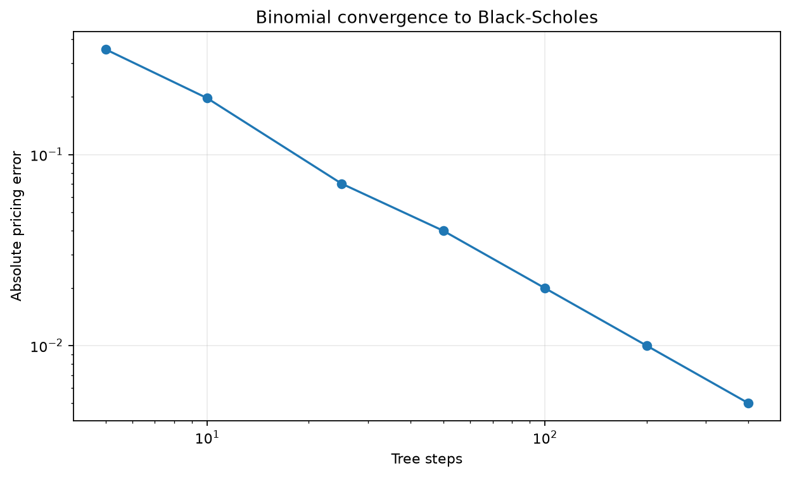
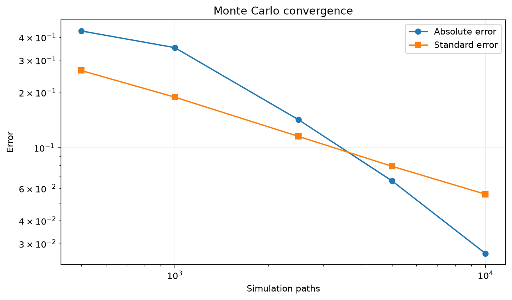
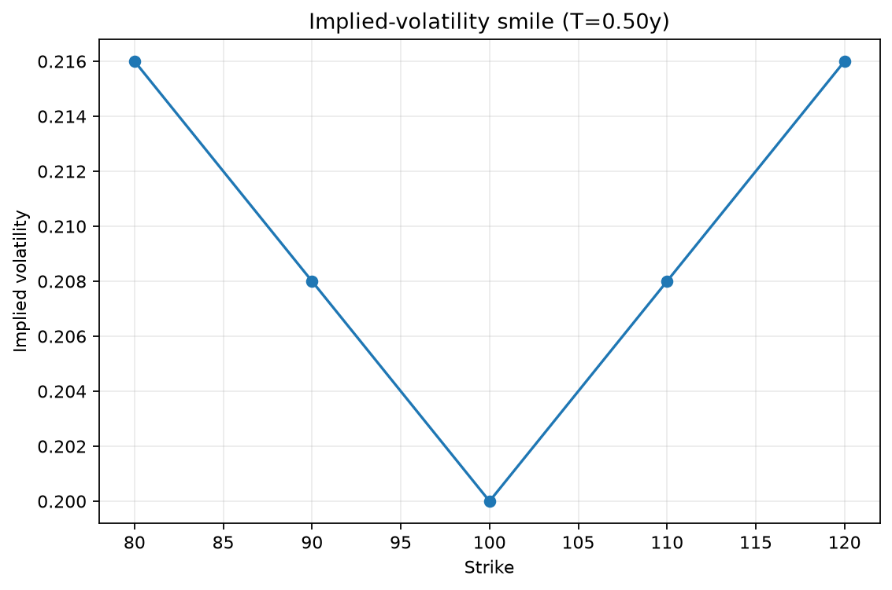

# options_pricer_python

`options_pricer_python` is a quantitative-finance portfolio project focused on pricing, calibration, simulation, hedging, and model validation for vanilla options.

It is designed to demonstrate:

- closed-form derivatives pricing;
- numerical methods and convergence analysis;
- Monte Carlo simulation and variance reduction;
- implied-volatility inversion;
- discrete delta hedging;
- quantitative testing and reproducible benchmarking;
- clean Python package design suitable for quant-dev and quant-research interviews.

## What The Library Implements

### Core models

- Black-Scholes pricing for European calls and puts
- Analytical Greeks: delta, gamma, vega, theta, rho
- Cox-Ross-Rubinstein binomial trees for European and American options
- Vectorised Monte Carlo pricing under geometric Brownian motion
- Variance reduction with antithetic variates and a discounted-terminal-stock control variate
- Robust implied-volatility inversion using Newton-Raphson with Brent fallback
- Discrete delta-hedging simulation with transaction costs and realised/implied volatility mismatch

### Advanced extension

- Arithmetic-average Asian-option pricing by Monte Carlo

## Financial Assumptions

Unless otherwise stated, pricing uses the standard risk-neutral geometric Brownian motion model:

$$
dS_t = (r - q)S_t\,dt + \sigma S_t\,dW_t
$$

where:

- `S_t` is the underlying spot price
- `r` is the risk-free rate
- `q` is the dividend yield
- `sigma` is volatility

For European options, the Black-Scholes prices are:

$$
C = S_0 e^{-qT} N(d_1) - K e^{-rT} N(d_2)
$$

$$
P = K e^{-rT} N(-d_2) - S_0 e^{-qT} N(-d_1)
$$

with

$$
d_1 = \frac{\ln(S_0/K) + (r - q + \tfrac{1}{2}\sigma^2)T}{\sigma\sqrt{T}},
\qquad
d_2 = d_1 - \sigma\sqrt{T}
$$

Put-call parity is validated as:

$$
C - P = S_0 e^{-qT} - K e^{-rT}
$$

The repository explicitly distinguishes:

- model price: a price implied by the pricing model under risk-neutral assumptions
- market price: an externally observed price used for implied-volatility inversion
- implied volatility: the volatility that reproduces a market price under the model
- realised volatility: the volatility used to generate simulated underlying paths

## Installation

Core installation:

```bash
pip install -e .
```

Development installation with tests, plotting, and linting:

```bash
pip install -e ".[dev]"
```

## Quick Start

```python
from options_pricer import (
    EuropeanOption,
    black_scholes_price,
    black_scholes_greeks,
    cox_ross_rubinstein_price,
    implied_volatility,
    monte_carlo_price,
    simulate_delta_hedge,
)

option = EuropeanOption(
    spot=100.0,
    strike=100.0,
    maturity=1.0,
    rate=0.05,
    volatility=0.20,
)

call_price = black_scholes_price(option, "call")
call_greeks = black_scholes_greeks(option, "call")
tree_price = cox_ross_rubinstein_price(option, "call", steps=200).price
mc_price = monte_carlo_price(option, "call", paths=10_000, steps=100).price
iv = implied_volatility(option, "call", market_price=call_price)
hedge = simulate_delta_hedge(option, "call", paths=1_000, steps=252, rebalance_every=5)

print(call_price)
print(call_greeks)
print(tree_price, mc_price, iv)
print(hedge.mean_error, hedge.std_error)
```

## Architecture

```text
src/
    options_pricer/
        __init__.py
        instruments.py
        black_scholes.py
        binomial.py
        monte_carlo.py
        implied_volatility.py
        hedging.py
        exotics.py
        validation.py
        plotting.py
        contracts.py
        euro_options.py
        models/                 # backward-compatible wrappers
tests/
examples/
    output/
benchmarks/
.github/workflows/ci.yml
```

Module responsibilities:

- `instruments.py`: typed option contracts and shared value objects
- `black_scholes.py`: closed-form pricing, vectorised input support, analytical Greeks
- `binomial.py`: efficient backward-induction CRR trees with American exercise
- `monte_carlo.py`: GBM simulation, Monte Carlo pricing, convergence tables, variance-reduction comparison
- `implied_volatility.py`: no-arbitrage validation and implied-volatility inversion
- `hedging.py`: self-financing delta-hedging simulation and error summaries
- `validation.py`: finite-difference Greeks and no-arbitrage helpers
- `plotting.py`: tables, plots, and portfolio-style reporting helpers
- `exotics.py`: advanced extension built on the core simulation stack

## Validation Approach

The project emphasizes measurable correctness rather than cosmetic output.

The test suite covers:

- benchmark Black-Scholes values
- put-call parity
- expiry and near-zero-volatility boundary behavior
- analytical Greeks versus finite-difference approximations
- binomial convergence to Black-Scholes
- American-option inequalities
- Monte Carlo confidence intervals
- variance-reduction effectiveness
- implied-volatility round trips
- invalid-input handling
- hedging error sensitivity to rebalancing frequency and transaction costs
- Asian-option sanity checks

Current automated result:

- `29` tests passing under `pytest`

Run locally with:

```bash
PYTHONPATH=src ./.venv/bin/pytest -q
```

## Sample Results

All values below are from actual local runs on July 23, 2026 using this repository.

### 1. Pricing dashboard



This figure decomposes option premium into intrinsic value and time value, and compares Black-Scholes, binomial, and Monte Carlo prices for an at-the-money one-year option.

### 2. Binomial convergence



Example convergence table for a one-year at-the-money call:

| Steps | Binomial Price | Black-Scholes | Absolute Error |
| --- | ---: | ---: | ---: |
| 5 | 10.805934 | 10.450584 | 0.355350 |
| 50 | 10.410692 | 10.450584 | 0.039892 |
| 200 | 10.440591 | 10.450584 | 0.009992 |
| 400 | 10.445586 | 10.450584 | 0.004998 |

This demonstrates the expected convergence of the CRR tree toward the closed-form European benchmark.

### 3. Monte Carlo variance reduction

Measured comparison for a 10,000-path call-pricing run:

| Method | Price | Absolute Error | Std. Error | 95% CI Width | Runtime (s) |
| --- | ---: | ---: | ---: | ---: | ---: |
| Standard | 10.481044 | 0.030460 | 0.147789 | 0.579332 | 0.182699 |
| Antithetic | 10.517950 | 0.067366 | 0.148638 | 0.582661 | 0.083915 |
| Antithetic + Control Variate | 10.496644 | 0.046060 | 0.056707 | 0.222292 | 0.052806 |

In this run, the control-variate estimator reduced confidence-interval width from `0.579332` to `0.222292`, a reduction of about `61.6%`.

### 4. Monte Carlo convergence versus path count



Example output:

| Paths | Price | Std. Error | 95% CI Width | Absolute Error |
| --- | ---: | ---: | ---: | ---: |
| 500 | 10.883487 | 0.263379 | 1.032447 | 0.432904 |
| 2,500 | 10.592766 | 0.115244 | 0.451756 | 0.142182 |
| 10,000 | 10.477077 | 0.055756 | 0.218562 | 0.026494 |

### 5. Implied-volatility smile



The included example uses a synthetic option chain to demonstrate the implied-volatility tooling and smile/surface plotting interface without requiring internet access or a live market-data dependency.


## Examples

The repository includes runnable examples for:

1. Black-Scholes pricing and Greeks
2. Binomial convergence
3. Monte Carlo variance reduction
4. Monte Carlo error versus path count
5. Implied-volatility smile and surface
6. Delta-hedging error versus rebalancing frequency
7. Runtime benchmarks
8. Asian-option Monte Carlo pricing

Run them with:

```bash
PYTHONPATH=src ./.venv/bin/python examples/02_binomial_convergence.py
PYTHONPATH=src ./.venv/bin/python examples/06_delta_hedging.py
```

Generated artifacts are written to `examples/output/`.

## Benchmarking

Benchmark script:

```bash
PYTHONPATH=src ./.venv/bin/python benchmarks/benchmark_pricing.py
```

Example runtime snapshot:

| Method | Price | Runtime (s) |
| --- | ---: | ---: |
| Black-Scholes | 10.450584 | 0.010501 |
| Binomial tree (500 steps) | 10.446585 | 0.024666 |
| Monte Carlo | 10.406783 | 0.218629 |
| Monte Carlo + antithetic | 10.504464 | 0.132079 |
| Monte Carlo + antithetic + control variate | 10.486357 | 0.095311 |

These timings are environment-specific, but they provide a reproducible relative comparison between the implemented methods.

## Labels And Interpretation

- `Spot` or `S`: current underlying price
- `Strike` or `K`: contractual exercise price
- `Maturity` or `T`: option expiry
- `Current time` or `t`: valuation time
- `Volatility` or `sigma`: annualized model volatility
- `Risk-free rate` or `r`: continuously compounded discount rate
- `Dividend yield` or `q`: continuous dividend yield
- `Intrinsic value`: payoff if exercised immediately
- `Time value`: option premium minus intrinsic value
- `Delta`: first-order sensitivity to spot
- `Gamma`: curvature with respect to spot
- `Vega`: sensitivity to volatility
- `Theta`: sensitivity to the passage of time
- `Rho`: sensitivity to interest rates
- `Hedging error`: terminal value of the hedging portfolio minus option payoff


## AI was used to generate this readme
