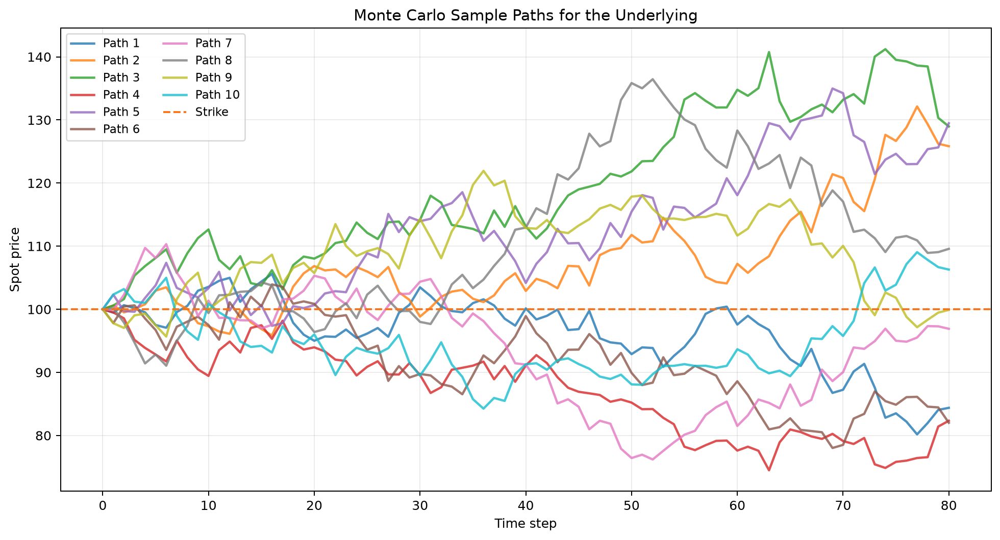

# options_pricer_python

`options_pricer_python` is a lightweight European option pricing package with:

- Black-Scholes closed-form pricing
- Cox-Ross-Rubinstein binomial trees
- Monte Carlo simulation with sample-path output
- Text and optional chart-based visualization helpers

The package is designed to do more than return a single number. It can also show:

- how intrinsic value and time value change as spot moves
- how a binomial tree propagates stock prices and option values
- how Monte Carlo sample paths evolve before the payoff is discounted back
- how different pricing models compare on the same contract

## Install

Core package:

```bash
pip install -e .
```

Optional plotting support:

```bash
pip install -e ".[viz]"
```

## Quick Start

```python
from options_pricer import (
    EuropeanOption,
    black_scholes_price,
    compare_model_prices,
    cox_ross_rubinstein_price,
    describe_option,
    monte_carlo_price,
    render_binomial_tree,
    render_price_table,
    render_sample_paths,
)
from options_pricer.visualization import price_curve

option = EuropeanOption(
    spot=100.0,
    strike=100.0,
    maturity=1.0,
    current_time=0.0,
    rate=0.05,
    volatility=0.2,
)

print(black_scholes_price(option, "call"))
print(describe_option(option, "call"))

rows = price_curve(option, "call", points=7)
print(render_price_table(rows))

tree = cox_ross_rubinstein_price(option, "call", steps=4)
print(render_binomial_tree(tree))

mc = monte_carlo_price(option, "call", simulations=2000, steps=50, seed=7)
print(render_sample_paths(mc.sample_paths))

print(compare_model_prices(option, "call"))
```

Example text output:

```text
Call option summary
Spot=100.00 Strike=100.00 Tau=1.00 Vol=20.00%
Price=10.4506 Intrinsic=0.0000 Time value=10.4506
Greeks Delta=0.6368 Gamma=0.0188 Vega=37.5240 Theta=-6.4140 Rho=53.2325
```

## Available Models

### 1. Black-Scholes

Use when you want a fast closed-form benchmark for European options.

```python
from options_pricer import EuropeanOption, black_scholes_price

option = EuropeanOption(
    spot=100.0,
    strike=100.0,
    maturity=1.0,
    current_time=0.0,
    rate=0.05,
    volatility=0.2,
)

call_price = black_scholes_price(option, "call")
put_price = black_scholes_price(option, "put")
```

### 2. Binomial Tree

Use when you want to see the pricing recursion node by node.

```python
from options_pricer import cox_ross_rubinstein_price, render_binomial_tree

tree = cox_ross_rubinstein_price(option, "call", steps=5)
print(render_binomial_tree(tree))
```

### 3. Monte Carlo

Use when you want simulated terminal distributions and sample paths.

```python
from options_pricer import monte_carlo_price, render_sample_paths

mc = monte_carlo_price(option, "call", simulations=5000, steps=100, seed=7)
print(mc.price, mc.std_error, mc.confidence_interval)
print(render_sample_paths(mc.sample_paths))
```

## Visualization Helpers

### Price / Intrinsic / Time Value Table

```python
from options_pricer.visualization import price_curve
from options_pricer import render_price_table

rows = price_curve(option, "call", points=9)
print(render_price_table(rows))
```

### Optional matplotlib charts

If you install `.[viz]`, you can generate charts directly:

```python
from options_pricer import plot_price_curve
from options_pricer.visualization import price_curve

rows = price_curve(option, "call", points=21)
figure, axis = plot_price_curve(rows, title="Call value vs spot")
figure.savefig("call_value_vs_spot.png", dpi=150, bbox_inches="tight")
```

## Example Plots

The repository now includes two example figures generated from the default at-the-money case:

- spot price `S = 100`
- strike price `K = 100`
- maturity `T = 1 year`
- risk-free rate `r = 5%`
- volatility `sigma = 20%`

### Pricing dashboard


This dashboard has four panels:

1. `Call Value vs Spot`
   This shows how the call price changes as the underlying spot price moves.
   The solid line is the full model price.
   The dashed line is the intrinsic value.
   The shaded region between them is the time value.

2. `Put Value vs Spot`
   This shows the same breakdown for the put option.
   As the spot price falls below the strike, the put gains intrinsic value.

3. `Time Value Profile`
   This isolates the part of the option premium that comes from time and uncertainty.
   Time value is usually largest near the strike because that is where future price moves matter most.

4. `Model Price Comparison`
   This compares the three implemented pricing models:
   Black-Scholes, binomial tree, and Monte Carlo.
   In this example they are close to one another, which is a good sanity check.

### Monte Carlo sample paths



This chart shows simulated future paths for the underlying asset used in the Monte Carlo model.

- Each colored line is one simulated path for the spot price over time.
- The dashed horizontal line is the strike price.
- The x-axis is the simulation step.
- The y-axis is the simulated spot price.

This helps build intuition for what Monte Carlo is doing:

- some paths finish above the strike, which tends to help a call
- some finish below the strike, which tends to reduce or eliminate call payoff
- the option price comes from averaging discounted payoffs across many such paths

## What The Labels Mean

The plots and text outputs use the standard option-pricing labels below.

- `Spot price` or `S`: the current price of the underlying asset
- `Strike price` or `K`: the fixed price written into the option contract
- `Maturity` or `T`: when the option expires
- `Current time` or `t`: the valuation time, usually `0` in examples
- `Volatility` or `sigma`: how much the underlying is expected to move
- `Risk-free rate` or `r`: the continuously compounded interest rate used for discounting
- `Intrinsic value`: what the option would be worth if it expired immediately
- `Time value`: `option price - intrinsic value`
- `Call price`: the value of the right to buy at the strike
- `Put price`: the value of the right to sell at the strike
- `Delta`: how much the option price changes for a small move in spot
- `Gamma`: how fast delta changes as spot moves
- `Vega`: how sensitive the option price is to volatility
- `Theta`: how much value tends to decay as time passes
- `Rho`: how sensitive the option price is to interest rates

## Test

```bash
PYTHONPATH=src python3 -m unittest discover -s src/options_pricer/tests -q
```
